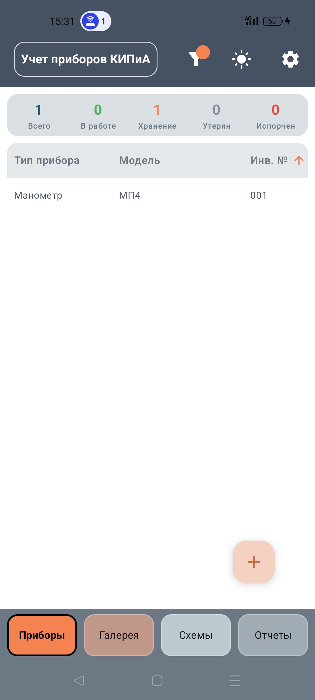
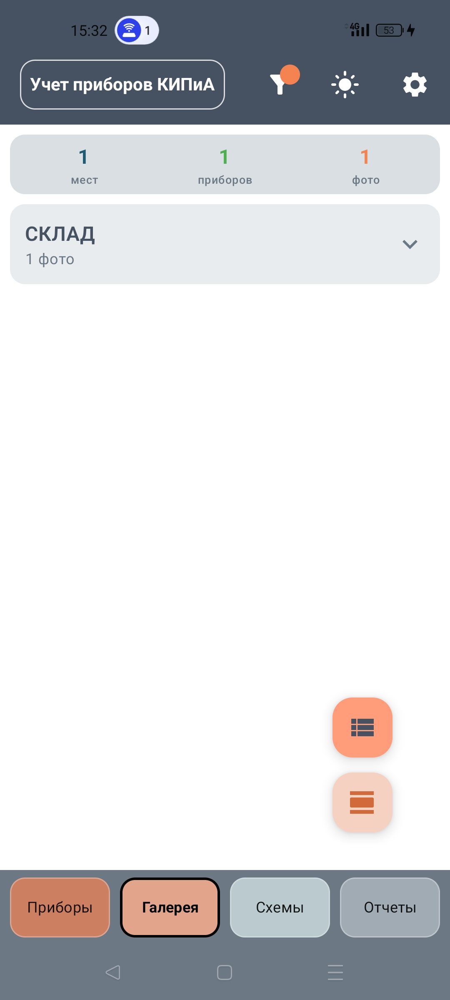
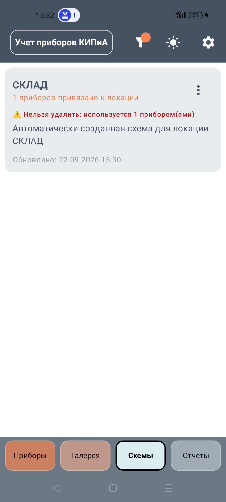
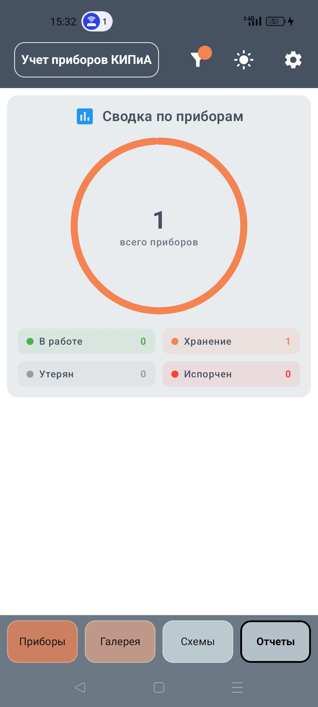

# KIPiA Management Mobile


**KIPiA Management Mobile** — мобильное приложение для управления приборами учета и контроля, с возможностью визуализации схем расположения оборудования, ведения фотоархива и генерации отчетов. Обеспечивает двухстороннюю синхронизацию с десктопной версией [KIPiA_Management](https://github.com/VladimirShi136/KIPiA_Management).

---

## 📋 Содержание
1. [Основные возможности](#-основные-возможности)
2. [Скриншоты интерфейса](#-скриншоты-интерфейса)
3. [Установка и запуск](#-установка-и-запуск)
4. [Технологии](#-технологии)
5. [Структура проекта](#-структура-проекта)
6. [Архитектура приложения](#-архитектура-приложения)
7. [Разработка](#-разработка)
8. [Структура базы данных](#-структура-базы-данных)
9. [Лицензия](#-лицензия)
10. [Контакты и поддержка](#-контакты-и-поддержка)

---

## 🚀 Основные возможности

### 📊 Управление приборами
- **CRUD операции** с приборами (создание, просмотр, редактирование, удаление)
- **Фильтрация и поиск** по всей таблице приборов
- **Импорт/экспорт** данных
- **Валидация данных** при вводе

### 📸 Галерея фотографий
- **Привязка фотографий** к приборам через камеру или галерею
- **Просмотр** фотографий в полноэкранном режиме
- **Управление фото-коллекцией**

### 🗺️ Редактор схем
- **Визуальное расположение** приборов на схемах через Canvas
- **Рисование фигур** (прямоугольники, эллипсы, линии, текст)
- **Привязка приборов** к позициям на схеме
- **Двупальцевые жесты** для масштабирования и перемещения
- **Удаление и редактирование** объектов на схеме

### 📈 Отчетность
- **Генерация отчетов** по приборам
- **Визуализация данных** с диаграммами
- **Фильтрация отчетов** по статусу, типу, месту установки, производителю, году

### ⚙️ Дополнительные функции
- **Темная/светлая тема** с переключением на лету
- **Логирование операций** (Timber)
- **Синхронизация данных** с десктопным приложением с разрешением конфликтов
- **Проверка целостности БД** перед операциями
- **Bottom Navigation** для быстрого перехода между разделами

---

## 🖼️ Скриншоты интерфейса

### Таблица приборов

*Список приборов с фильтрацией*

### Галерея фотографий

*Галерея фотографий*

### Редактор схем

*Редактор схем с панелью инструментов*

### Отчеты

*Экран с отчетами и диаграммами*

---

## ⚡ Установка и запуск

### Установка через APK

1. Скачайте последний релиз `KIPiA_Management_v*.apk` из раздела [Releases](https://github.com/VladimirShi136/KIPiA_Management_Mobile/releases)
2. Разрешите установку из неизвестных источников в настройках устройства
3. Запустите APK файл и следуйте инструкциям

**Примечание:** Для Android 8.0+ (API 26) и выше.

### Сборка APK из исходников

#### Предварительные требования
- **Android Studio Hedgehog** или новее
- **JDK 17**
- **Android SDK 34**

#### Процесс сборки

```bash
# Клонирование репозитория
git clone https://github.com/VladimirShi136/KIPiA_Management_Mobile
cd KIPiA_Management_Mobile

# Открытие проекта в Android Studio
# File -> Open -> выберите папку проекта
```

1. Откройте проект в Android Studio
2. Дождитесь синхронизации Gradle
3. Для сборки release APK: `Build -> Build Bundle(s)/APK(s) -> Build APK(s)`
4. Готовый APK будет находиться в `app/build/outputs/apk/release/`

### Запуск на эмуляторе или устройстве

```bash
# Сборка и установка debug версии
./gradlew installDebug
```

---

## 🛠️ Технологии

- **Язык:** Kotlin 1.9.23
- **UI Framework:** Jetpack Compose 2024.05.00 + Material 3
- **База данных:** Room 2.6.1 (SQLite)
- **DI:** Hilt 2.50
- **Навигация:** Navigation Compose 2.7.7
- **Асинхронность:** Coroutines 1.7.3 + Flow
- **Изображения:** Coil 2.5.0
- **Логирование:** Timber 5.0.1
- **Сборка:** Gradle 8.5.1 + AGP 8.5.1
- **Минимальный SDK:** 24 (Android 7.0)
- **Целевой SDK:** 34 (Android 14)

---

## 🗂️ Структура проекта

<pre>
<code>
<b>KIPiA_Management_Mobile/</b>
│
├── <b>📁 app/src/main/java/com/kipia/management/mobile/</b> <i># Исходный код</i>
│   ├── MainActivity.kt                         <i># Точка входа приложения</i>
│   ├── <b>🎨 ui/</b>                            <i># UI слой</i>
│   │   ├── screens/                            <i># Экраны приложения</i>
│   │   │   ├── devices/                        <i># Экраны приборов</i>
│   │   │   ├── photos/                         <i># Галерея фотографий</i>
│   │   │   ├── schemes/                        <i># Экраны схем</i>
│   │   │   ├── reports/                        <i># Отчеты</i>
│   │   │   └── settings/                       <i># Настройки</i>
│   │   ├── components/                         <i># Переиспользуемые компоненты</i>
│   │   │   ├── scheme/                         <i># Компоненты редактора схем</i>
│   │   │   ├── photos/                         <i># Компоненты галереи</i>
│   │   │   ├── reports/                        <i># Компоненты отчетов</i>
│   │   │   ├── dialogs/                        <i># Диалоги</i>
│   │   │   └── table/                          <i># Таблицы и фильтры</i>
│   │   ├── theme/                              <i># Тема оформления</i>
│   │   ├── navigation/                         <i># Навигация</i>
│   │   └── shared/                             <i># Общие утилиты UI</i>
│   ├── <b>🧠 viewmodel/</b>                     <i># ViewModel</i>
│   ├── <b>📦 repository/</b>                    <i># Репозитории</i>
│   ├── <b>📊 data/</b>                          <i># Data слой</i>
│   │   ├── database/                           <i># Room база данных</i>
│   │   ├── dao/                                <i># DAO интерфейсы</i>
│   │   └── entities/                           <i># Сущности Room</i>
│   ├── <b>⚙️ managers/</b>                      <i># Менеджеры (Sync, Photo, Shape и др.)</i>
│   ├── <b>🔧 services/</b>                      <i># Сервисы (SyncService)</i>
│   ├── <b>💉 di/</b>                            <i># Модули Hilt</i>
│   ├── <b>🎯 domain/</b>                        <i># Доменный слой (UseCase)</i>
│   └── <b>🎯 commands/</b>                      <i># Команды (undo/redo)</i>
│
├── <b>📁 app/src/main/res/</b>                  <i># Ресурсы Android</i>
│   ├── values/                                 <i># Строки, темы, цвета</i>
│   ├── drawable/                               <i># Иконки и изображения</i>
│   ├── mipmap-*/                               <i># Иконки лаунчера</i>
│   └── xml/                                    <i># Конфигурации бэкапа</i>
│
├── <b>📁 app/src/main/assets/</b>               <i># Assets (если есть)</i>
│
├── <b>📁 gradle/</b>                             <i># Конфигурация зависимостей</i>
│   └── libs.versions.toml
│
├── <b>⚙️ build.gradle.kts</b>                   <i># Конфигурация модуля app</i>
├── <b>⚙️ settings.gradle.kts</b>               <i># Настройки проекта</i>
├── <b>⚙️ gradle.properties</b>                 <i># Свойства Gradle</i>
├── <b>📄 README.md</b>                          <i># Вы читаете этот файл</i>
└── <b>📄 LICENSE</b>                            <i># Лицензия MIT</i>
</code>
</pre>

---

## 📊 Архитектура приложения

### Многослойная архитектура (MVVM + Repository):
```
┌─────────────────────────────────────┐
│ Presentation Layer                  │
│ (Jetpack Compose + ViewModel)       │
├─────────────────────────────────────┤
│ Domain Layer                        │
│ (Use Cases)                         │
├─────────────────────────────────────┤
│ Data Layer                          │
│ (Repositories, Room DAO)            │
├─────────────────────────────────────┤
│ Database                            │
│ (Room / SQLite)                     │
└─────────────────────────────────────┘
```

### DI (Dependency Injection):
```
App -> Application (Hilt)
     ├── DatabaseModule (Room)
     ├── RepositoryModule (Repositories)
     └── ViewModel injection via Hilt Navigation Compose
```

### Ключевые особенности реализации:

1. **Canvas редактор схем** - кастомный Composable с жестами и ShapeManager
2. **Room Database** - локальная БД с DAO и Entity
3. **Hilt DI** - внедрение зависимостей
4. **Flow + StateFlow** - реактивный поток данных
5. **Navigation Compose** - навигация между экранами
6. **Менеджер синхронизации** - обмен данными с десктопом через ZIP
7. **Camera Manager** - работа с камерой и галереей
8. **Темы оформления** - светлая/темная тема Compose Material3
9. **Логирование** - Timber
10. **Command Manager** - паттерн Command для undo/redo в редакторе

### База данных:
- **СУБД:** SQLite через ORM Room
- **Автоматическое создание** при первом запуске
- **Миграции:** версионирование через Room
- **Синхронизация:** экспорт/импорт в ZIP с десктопным приложением

### Обработка ошибок:
- **Snackbar/Host** для отображения ошибок
- **Логирование** Timber
- **Валидация** входных данных

---

## 🔧 Разработка

### Настройка среды разработки

- Установите **Android Studio Hedgehog** или новее
- Импортируйте проект как Gradle проект
- Убедитесь, что установлен **Android SDK 34** и **JDK 17**

### Запуск на эмуляторе или устройстве

1. Создайте или выберите эмулятор с API 24+
2. Нажмите Run (▶️) в Android Studio
3. Выберите целевое устройство/эмулятор

### Сборка release APK

```bash
# Сборка release APK
./gradlew assembleRelease
```

Готовый APK будет находиться в `app/build/outputs/apk/release/app-release.apk`

---

## 🗃️ Структура базы данных

### Entity: Device (Приборы)
```kotlin
@Entity(tableName = "devices")
data class Device(
    @PrimaryKey(autoGenerate = true) val id: Long = 0,
    val type: String,
    val name: String,
    val manufacturer: String,
    @ColumnInfo(index = true) val inventoryNumber: String,
    val year: Int?,
    val measurementLimit: String?,
    val accuracyClass: Double?,
    val location: String,
    val valveNumber: String?,
    val status: String,
    val additionalInfo: String?,
    val photos: String, // список имён файлов через ";"
    val updatedAt: Long,
    val deletedAt: Long = 0,
    val lastSyncedAt: Long = 0
)
```

### Entity: Scheme (Схемы)
```kotlin
@Entity(tableName = "schemes")
data class Scheme(
    @PrimaryKey(autoGenerate = true) val id: Long = 0,
    val name: String,
    val description: String?,
    val data: String, // JSON данные схемы
    val updatedAt: Long,
    val deletedAt: Long = 0,
    val lastSyncedAt: Long = 0
)
```

### Entity: DeviceLocation (Расположение приборов)
```kotlin
@Entity(
    tableName = "device_locations",
    primaryKeys = ["deviceId", "schemeId"],
    foreignKeys = [
        ForeignKey(entity = Device::class, parentColumns = ["id"], childColumns = ["deviceId"], onDelete = ForeignKey.CASCADE),
        ForeignKey(entity = Scheme::class, parentColumns = ["id"], childColumns = ["schemeId"], onDelete = ForeignKey.CASCADE)
    ]
)
data class DeviceLocation(
    val deviceId: Long,
    val schemeId: Long,
    val x: Float,
    val y: Float,
    val rotation: Float = 0f,
    val updatedAt: Long,
    val deletedAt: Long = 0,
    val lastSyncedAt: Long = 0
)
```

---

## 📄 Лицензия

Этот проект распространяется под лицензией **MIT License**.

Полный текст лицензии доступен в файле [LICENSE](LICENSE).

**Коротко о сути лицензии MIT:**
*   ✅ **Можно:** свободно использовать, копировать, изменять, публиковать, распространять и продавать ПО.
*   ✅ **Можно:** использовать в коммерческих закрытых проектах.
*   ⚠️ **Условие:** во всех копиях или существенных частях должна быть сохранена данная информация об авторском праве и текст лицензии.
*   ❌ **Без гарантий:** автор не несёт ответственности за возможные проблемы при использовании ПО.

---

## 📞 Контакты и поддержка

* Автор: [VladimirShi136](https://github.com/VladimirShi136)
* Issues: [Перейти к вопросам и задачам](https://github.com/VladimirShi136/KIPiA_Management_Mobile/issues)
* Десктопная версия: [KIPiA_Management](https://github.com/VladimirShi136/KIPiA_Management)

---
